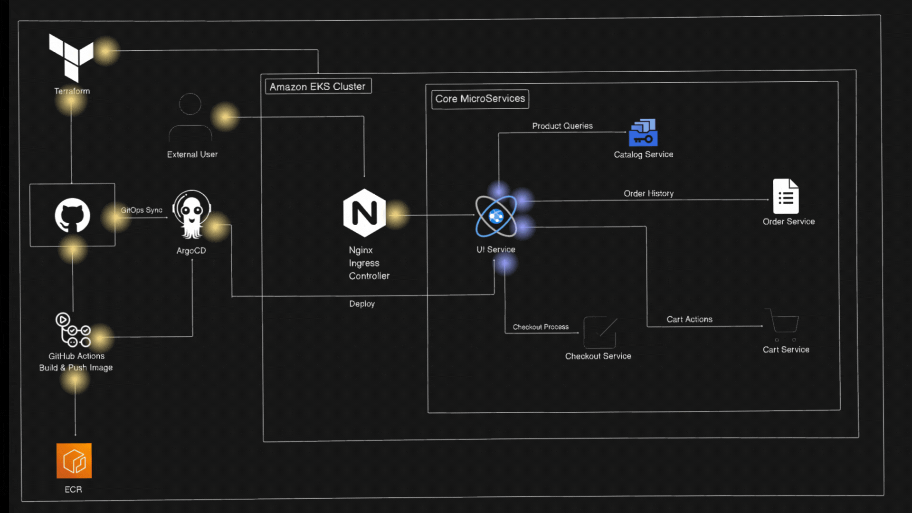
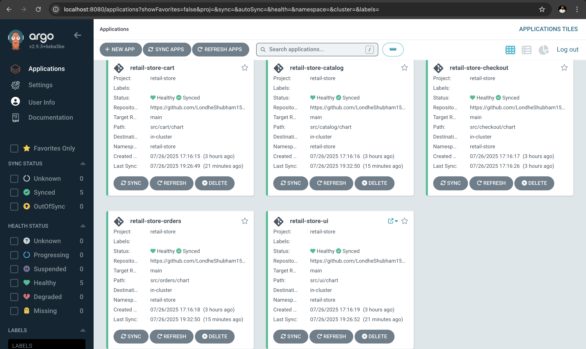

# Retail Store Sample App — GitOps with Amazon EKS Auto Mode


A microservices retail application deployed on **Amazon EKS** using **GitOps principles**. This project demonstrates end-to-end cloud-native delivery: infrastructure provisioned with Terraform, container images stored in Amazon ECR, deployments managed by Argo CD, and CI/CD pipelines automated with GitHub Actions.

---

## Table of Contents

- [Architecture](#architecture)
- [Technology Stack](#technology-stack)
- [Project Structure](#project-structure)
- [Infrastructure](#infrastructure)
- [GitOps Workflow](#gitops-workflow)
- [CI/CD Pipeline](#cicd-pipeline)
- [Deployment Guide](#deployment-guide)
- [Argo CD](#argo-cd)
- [Verification](#verification)
- [Troubleshooting](#troubleshooting)
- [Cleanup](#cleanup)

---

## Architecture

The application is deliberately composed of multiple independent services, each with its own technology stack and infrastructure dependencies.


| Service | Language | Description |
|---|---|---|
| [UI](./src/ui/) | Java | Store frontend — renders the shopping interface |
| [Catalog](./src/catalog/) | Go | Product catalog API |
| [Cart](./src/cart/) | Java | Shopping cart API |
| [Orders](./src/orders/) | Java | Order management API |
| [Checkout](./src/checkout/) | Node.js | Checkout orchestration API |

Each service is packaged as a container image, versioned in Amazon ECR, and deployed independently via its own Helm chart and Argo CD application.



---

## Technology Stack

| Category | Technology |
|---|---|
| Cloud | AWS |
| Container Orchestration | Amazon EKS, EKS Auto Mode, Kubernetes 1.33 |
| Infrastructure as Code | Terraform |
| Container Registry | Amazon ECR |
| GitOps | Argo CD |
| CI/CD | GitHub Actions |
| Package Management | Helm |
| Ingress | NGINX Ingress Controller |
| Certificate Management | Cert-Manager |
| Networking | VPC, NAT Gateway, NLB |
| Identity & Access | AWS IAM |

---

## Project Structure

```text
eks-argo-microservice/
├── .github/
│   └── workflows/
│       └── deploy.yml          # GitHub Actions CI/CD pipeline
├── argocd/
│   ├── applications/           # Argo CD Application manifests (one per service)
│   └── projects/               # Argo CD Project manifests
├── src/
│   ├── ui/                     # Java frontend service + Helm chart
│   ├── catalog/                # Go catalog service + Helm chart
│   ├── cart/                   # Java cart service + Helm chart
│   ├── orders/                 # Java orders service + Helm chart
│   └── checkout/               # Node.js checkout service + Helm chart
├── terraform/                  # All AWS infrastructure definitions
│   ├── main.tf                 # VPC and EKS cluster
│   ├── addons.tf               # NGINX Ingress, Cert-Manager
│   ├── argocd.tf               # Argo CD Helm installation + manifest apply
│   ├── variables.tf
│   ├── locals.tf
│   ├── outputs.tf
│   └── versions.tf
├── docs/
│   └── images/                 # Screenshots and diagrams
├── BRANCHING_STRATEGY.md       # Detailed branching and CI/CD strategy
└── README.md
```

---

## Infrastructure

All AWS resources are defined in `terraform/` and provisioned in a single `terraform apply`. There are no manual steps for infrastructure creation.

### Resources Created

| Resource | Details |
|---|---|
| **VPC** | CIDR `10.0.0.0/16`, public + private subnets across multiple AZs |
| **NAT Gateway** | Single NAT gateway (configurable) routing private subnet egress |
| **Internet Gateway** | Public internet access for load balancer |
| **Amazon EKS** | Kubernetes 1.33, EKS Auto Mode enabled (`general-purpose` node pool) |
| **EKS Encryption** | KMS key for cluster secret encryption |
| **NGINX Ingress** | Deployed via Helm; backed by an internet-facing AWS NLB |
| **Cert-Manager** | Deployed via Helm for SSL certificate management |
| **Argo CD** | Deployed via Helm into the `argocd` namespace |
| **IAM** | Cluster creator admin permissions, OIDC provider for service accounts |

### EKS Auto Mode

EKS Auto Mode is enabled with a `general-purpose` node pool. AWS manages node provisioning, scaling, and OS patching automatically — no managed node groups or self-managed nodes are required.

---

## GitOps Workflow

```
Developer pushes code to src/
        │
        ▼
GitHub (main branch)
        │
        ▼
GitHub Actions triggers on push to src/**
        │
        ▼
Docker image built per changed service
        │
        ▼
Image pushed to Amazon ECR
        │
        ▼
GitHub Actions updates Helm values.yaml
(image tag → short commit SHA)
        │
        ▼
Change committed back to repository
        │
        ▼
Argo CD detects Git state has changed
        │
        ▼
Argo CD syncs Helm chart to Amazon EKS
        │
        ▼
Kubernetes Pods updated with new image
```

Argo CD continuously reconciles the desired state in Git against the live state in the cluster. If a resource drifts from what is declared in Git (e.g. someone manually edits a Deployment), Argo CD automatically corrects it (`selfHeal: true`). Stale resources are pruned automatically (`prune: true`).

---

## CI/CD Pipeline

The pipeline is defined in [`.github/workflows/deploy.yml`](./.github/workflows/deploy.yml) and triggers on any push to the `main` branch that modifies files inside `src/`.

### Pipeline Stages

**1. Detect Changed Services**

The pipeline inspects `git diff` between the last two commits and identifies which services changed (`ui`, `catalog`, `cart`, `checkout`, `orders`). Only changed services are built, avoiding unnecessary work. A manual `workflow_dispatch` trigger builds all services.

**2. Build and Push to ECR**

For each changed service:
- Authenticates to AWS using repository secrets
- Logs in to Amazon ECR
- Creates the ECR repository if it does not exist (scan on push enabled, AES-256 encryption)
- Builds the Docker image from `src/<service>/`
- Tags the image with both the short commit SHA (7 characters) and `latest`
- Pushes both tags to ECR

**3. Update Helm Values**

The pipeline uses `awk` to update only the main service image in `src/<service>/chart/values.yaml`:
- Sets `image.repository` to the ECR repo URL
- Sets `image.tag` to the short commit SHA

Infrastructure component images (MySQL, Redis, PostgreSQL, RabbitMQ) within the same chart are left untouched.

**4. Commit and Push**

The updated `values.yaml` is committed to the repository by `gitops@github.com` with a descriptive commit message. This is what triggers Argo CD to pick up the new image tag.

### Required GitHub Secrets

Navigate to **Repository → Settings → Secrets and variables → Actions** and add:

| Secret | Value |
|---|---|
| `AWS_ACCESS_KEY_ID` | IAM user access key |
| `AWS_SECRET_ACCESS_KEY` | IAM user secret key |
| `AWS_REGION` | AWS region (e.g. `us-west-2`) |
| `AWS_ACCOUNT_ID` | 12-digit AWS account ID |

The IAM user requires permissions to authenticate to ECR and push images.

---

## Deployment Guide

### Prerequisites

Ensure the following tools are installed before starting:

| Tool | Version | Install |
|---|---|---|
| AWS CLI | v2+ | [docs.aws.amazon.com](https://docs.aws.amazon.com/cli/latest/userguide/install-cliv2.html) |
| Terraform | 1.0+ | [developer.hashicorp.com](https://developer.hashicorp.com/terraform/install) |
| kubectl | 1.33+ | [kubernetes.io](https://kubernetes.io/docs/tasks/tools/) |
| Docker | 20.0+ | [docs.docker.com](https://docs.docker.com/get-docker/) |
| Helm | 3.0+ | [helm.sh](https://helm.sh/docs/intro/install/) |
| Git | 2.0+ | [git-scm.com](https://git-scm.com/downloads) |

<details>
<summary><strong>One-line installation script (Ubuntu/Debian)</strong></summary>

```bash
#!/bin/bash

# AWS CLI
curl "https://awscli.amazonaws.com/awscli-exe-linux-x86_64.zip" -o "awscliv2.zip"
unzip awscliv2.zip && sudo ./aws/install

# Terraform
curl -fsSL https://apt.releases.hashicorp.com/gpg | sudo apt-key add -
sudo apt-add-repository "deb [arch=amd64] https://apt.releases.hashicorp.com $(lsb_release -cs) main"
sudo apt-get update && sudo apt-get install -y terraform

# kubectl
curl -LO "https://dl.k8s.io/release/v1.33.3/bin/linux/amd64/kubectl"
chmod +x kubectl && sudo mv kubectl /usr/local/bin/

# Docker
curl -fsSL https://get.docker.com -o get-docker.sh && sudo sh get-docker.sh

# Helm
curl https://raw.githubusercontent.com/helm/helm/main/scripts/get-helm-3 | bash
```

</details>

---

### Step 1 — Configure AWS

```bash
aws configure
```

Provide your AWS Access Key ID, Secret Access Key, default region, and output format. The deploying identity requires permissions to create VPCs, EKS clusters, IAM roles, and Helm releases.

---

### Step 2 — Clone the Repository

```bash
git clone https://github.com/harshitsaxena214/eks-argo-microservice.git
cd eks-argo-microservice
```

---

### Step 3 — Deploy Infrastructure

```bash
cd terraform/
terraform init
terraform apply --auto-approve
```

This single apply creates and configures:
- VPC with public and private subnets
- Amazon EKS cluster (Auto Mode, Kubernetes 1.33)
- IAM roles and KMS encryption key
- NGINX Ingress Controller (via Helm)
- Cert-Manager (via Helm)
- Argo CD (via Helm) with all Argo CD Application and Project manifests

> [!NOTE]
> Terraform waits 30 seconds after the EKS cluster is ready before installing Argo CD, giving the cluster API time to stabilize.

---

### Step 4 — Configure kubectl

```bash
aws eks update-kubeconfig --name retail-store --region <region>
```

Replace `<region>` with the AWS region you deployed to (default: `us-west-2`).

Verify connectivity:

```bash
kubectl get nodes
```

---

### Step 5 — Access the Application (Public Image Deployment)

With infrastructure deployed, the application runs using public ECR images. Get the ingress load balancer address:

```bash
kubectl get svc -n ingress-nginx
```

Copy the `EXTERNAL-IP` of the `ingress-nginx-controller` service and open it in a browser to access the retail store.

---

### Step 6 — Configure GitHub Actions (GitOps Deployment)

> [!IMPORTANT]
> This step is only required for the automated CI/CD workflow that builds private images. If you are using the public image deployment from Step 5, you can skip this step.

Add the four secrets listed in the [CI/CD Pipeline](#cicd-pipeline) section to your GitHub repository. Once configured, any push to `src/` on the `main` branch will automatically:

1. Build updated Docker images
2. Push them to Amazon ECR
3. Update the Helm `values.yaml` with the new image tag
4. Trigger Argo CD to sync the cluster

For a detailed breakdown of the branching strategy and CI/CD configuration, see [BRANCHING_STRATEGY.md](./BRANCHING_STRATEGY.md).

---

## Argo CD

Argo CD is installed into the `argocd` namespace by Terraform and configured with one Application manifest per microservice (see [`argocd/applications/`](./argocd/applications/)). Each Application points to the corresponding Helm chart path in this repository.

**Why Argo CD?** It provides a continuous reconciliation loop between the Git repository (desired state) and the live Kubernetes cluster (actual state). If a deployment drifts — through a manual change, node replacement, or any other cause — Argo CD restores it to match Git automatically.

### Access the Argo CD Dashboard

**Get the admin password:**

```bash
kubectl -n argocd get secret argocd-initial-admin-secret \
  -o jsonpath='{.data.password}' | base64 -d
```

**Port-forward to the Argo CD server:**

```bash
kubectl port-forward svc/argocd-server -n argocd 8080:443
```

Open [https://localhost:8080](https://localhost:8080) in your browser.

- **Username:** `admin`
- **Password:** output of the command above

### Argo CD Dashboard



The dashboard shows real-time sync status, resource health, and allows manual sync or rollback for each application.

### Check Application Sync Status

```bash
# List all Argo CD applications and their sync/health status
kubectl get applications -n argocd

# Describe a specific application
kubectl describe application retail-store-ui -n argocd

# Check Argo CD pods are running
kubectl get pods -n argocd
```

---

## Verification

Run these commands after deployment to confirm all components are healthy:

```bash
# Verify cluster nodes are Ready
kubectl get nodes

# Check all retail-store pods are Running
kubectl get pods -n retail-store

# Check services and cluster IPs
kubectl get services -n retail-store

# Check ingress resource and address
kubectl get ingress -n retail-store

# Get the ingress controller external load balancer address
kubectl get svc -n ingress-nginx

# Check Argo CD application sync status
kubectl get applications -n argocd
```

---

## Troubleshooting

### Image Pull Errors

```
Failed to pull image "123456789012.dkr.ecr.us-west-2.amazonaws.com/retail-store-ui:abc1234"
```

- Verify the GitHub Actions pipeline completed successfully and the image exists in ECR
- Confirm that `AWS_ACCESS_KEY_ID`, `AWS_SECRET_ACCESS_KEY`, `AWS_REGION`, and `AWS_ACCOUNT_ID` secrets are set correctly in the repository
- Check IAM permissions: the deploying user needs `ecr:GetAuthorizationToken`, `ecr:BatchCheckLayerAvailability`, `ecr:PutImage`, and related permissions

### GitHub Actions Not Triggering

- Confirm the push includes changes inside `src/` — the workflow path filter is `src/**`
- Confirm GitHub Actions is enabled: **Repository → Settings → Actions → General**
- Review [BRANCHING_STRATEGY.md](./BRANCHING_STRATEGY.md) for full CI/CD setup instructions

### ECR / IAM Issues

- Run `aws sts get-caller-identity` to verify the AWS CLI is using the correct identity
- Confirm the IAM user has `ecr:CreateRepository` permission if repositories do not exist yet
- Check that `AWS_REGION` matches the region where EKS and ECR are deployed

### Kubernetes Issues

```bash
# Check pod logs for a specific service
kubectl logs -n retail-store -l app=ui --tail=50

# Describe a pod to see events and error messages
kubectl describe pod -n retail-store <pod-name>

# Check resource limits causing OOMKilled
kubectl top pods -n retail-store
```

### Argo CD Sync Issues

```bash
# Check Argo CD application status
kubectl get applications -n argocd

# Check Argo CD controller logs
kubectl logs -n argocd -l app.kubernetes.io/name=argocd-application-controller --tail=100

# Force a manual sync via the dashboard or CLI
# argocd app sync retail-store-ui
```

### Ingress / Load Balancer Issues

- Confirm the NGINX Ingress Controller pod is running: `kubectl get pods -n ingress-nginx`
- The NLB may take 2–5 minutes to provision after `terraform apply`
- Verify the ingress resource has an address assigned: `kubectl get ingress -n retail-store`
- Check NLB health checks: the controller exposes `/healthz` on port `10254`

---

## Cleanup

To remove all resources created by Terraform:

```bash
cd terraform/
terraform destroy --auto-approve
```

This removes the EKS cluster, VPC, NAT Gateway, IAM roles, and all Helm-managed components (NGINX, Cert-Manager, Argo CD).

> [!IMPORTANT]
> **Manual cleanup required:** Amazon ECR repositories created by GitHub Actions are not managed by Terraform and must be deleted manually from the AWS Console or via the AWS CLI:
>
> ```bash
> aws ecr delete-repository --repository-name retail-store-ui --force --region <region>
> aws ecr delete-repository --repository-name retail-store-catalog --force --region <region>
> aws ecr delete-repository --repository-name retail-store-cart --force --region <region>
> aws ecr delete-repository --repository-name retail-store-orders --force --region <region>
> aws ecr delete-repository --repository-name retail-store-checkout --force --region <region>
> ```
